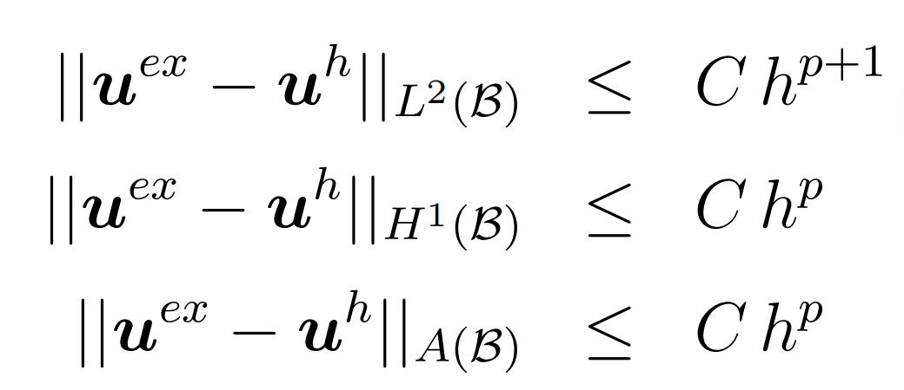
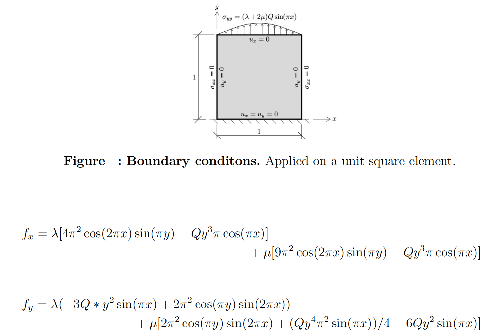
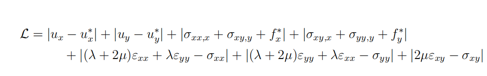
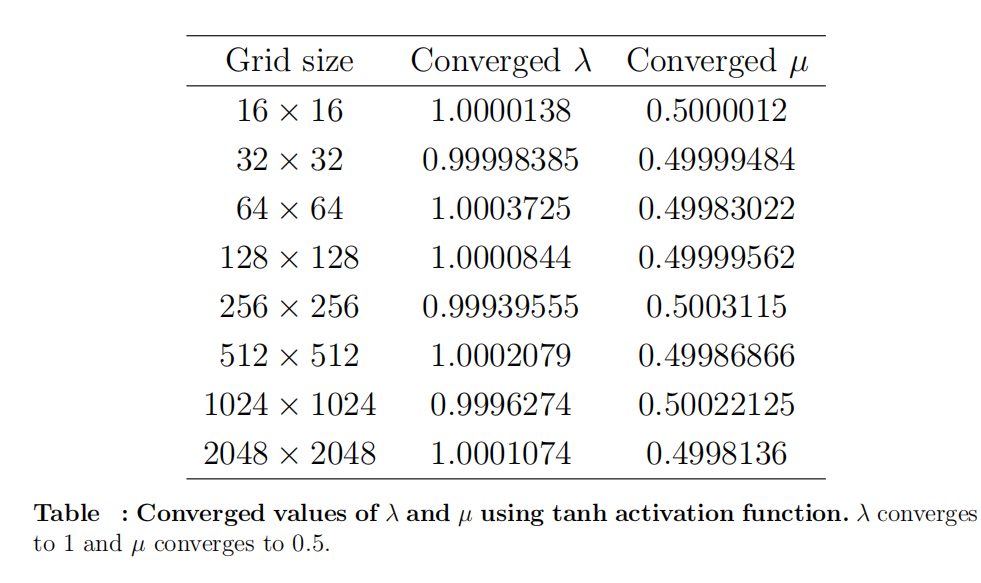
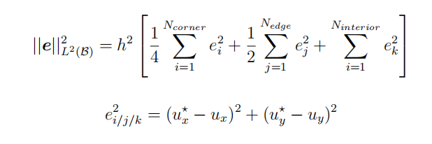
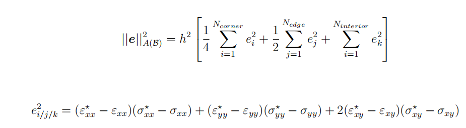
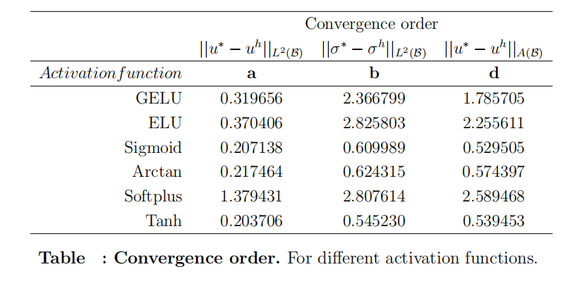
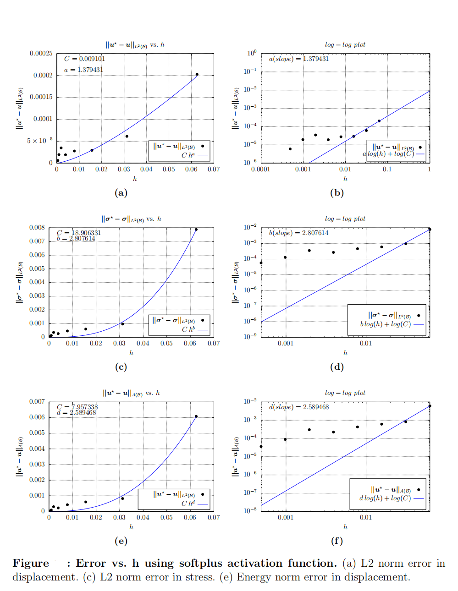

# PINNs-Applications-in-Linear-Elastic-Solid-Mechanics
##Abstract
PINN (Physics Informed Neural Network) is a deep learning based technique for solving PDEs 
(partial differential equations), ODEs (oridnary differential equations) which are an integral
part of engineering and computational sciences. It is guided by physical laws and data. It aims
to find parameters of neural network in order to approximate solution function of differential
equations. To achieve this, prior knowledge of system equations (PDEs, ODEs) and data are
made part of loss function which is minimised to find neural network with suitable parameters.
For solving inverse problems (system identification) the unknown parameters of the system are
made part of neural network and is obtained like any other parameters of neural network after
training.
This project is divided in a two parts. In first study, Lame parameters are identified
using tanh activation function. After that, six activation functions are analysed on the basis
of minimum loss, training time and convergence order for different error norms. In this study
softplus activation function performs best while elu (another activation function) performs
worst. Finally, a planar square plate is studied to find Lame parameters and convergence orders
for different error norms using softplus activation function. Since the actual solution data is not
available it was solved using Abaqus software.

## PINN
Physics Informed Neural Network (PINN) is a different class of Artificial Neural Network
(ANN) which aims to include governing equations into the neural network model. The
loss function in PINN gives representation to known data, boundary conditions as well
as governing equations. It requires very less data for training as compared to traditional
data-driven neural networks. It can be used to solve ODE’s, PDE’s when used as a forward
solver and can also identify parameters of differential equations (system identification).

## SciANN
SciANN is a high level API (Application Programming Interface) written in python
which is used for scientific computing including PINN. It runs Keras and Tensorflow in
backend. Follow this link to learn more: https://www.sciann.com/

## A priori estimates of convergence
This concept is used for second part of the study. A priori estimates for a numerical method are predictions on how the solution –or the error
of the numerical solution against the exact (very accurate reference solution)– converges. For sufficiently regular problems the following a priori estimates hold in the L2-norm, the H1-norm and the energy-norm A in the simulation domain B: 

  

# Parameter Identification 
## Problem
The elasticity problem selected for the parameter identification study by PINN is an unit
square element having constraints as shown in figure below. The origin lies at the bottom left
corner of the element. This element is subjected to body forces in x and y direction as
given by following equations.

  

The loss function is calculated by following equation:

  

## Results

  

  

# Activation function comparison

Following equations were used for L2 norm error calculation and energy norm error calculation:

  

  

## Result
Softplus performs better than all other activation functions studied.

  

  

  

